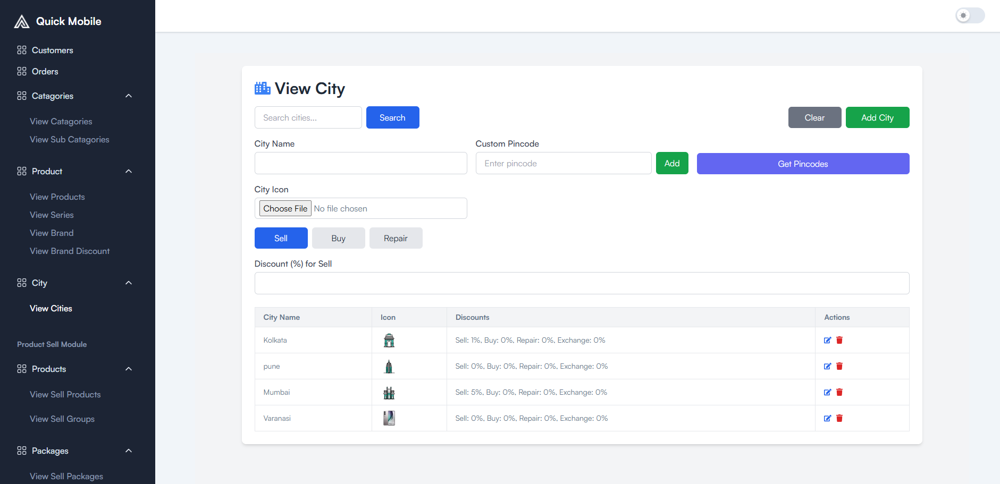
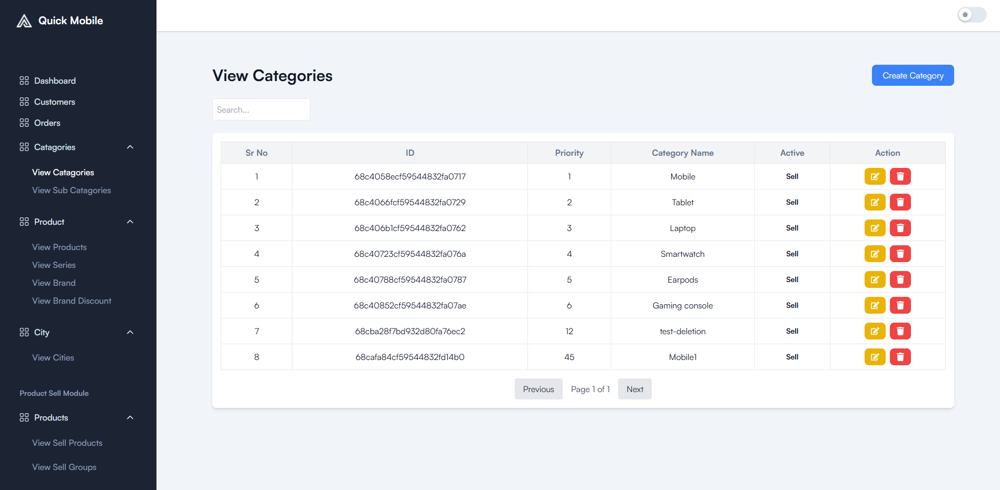
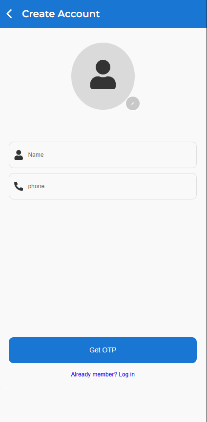

# 📱 Quick Mobile

Quick Mobile is a full-stack platform designed to simplify the process of selling and managing used mobile devices.  
On the **Customer side**, users can browse products, answer guided question-based packages, and place selling or buying orders with a smooth checkout experience.  
The **Admin Panel** provides role-based access (Super Admin & Admin) for managing products, brands, categories, banners, announcements, and partner operations with real-time analytics.  
The **Partner Application (PWA)** empowers partners and pickup staff with mobile-first accessibility, Aadhaar verification, real-time order allocation, location tracking, wallet system, and cross-device session recovery for seamless field operations.  
On the **Server side**, secure APIs handle authentication, payments, file uploads, and business logic with middleware-based authorization, ensuring data consistency and compliance.  
The system also integrates third-party services like AWS S3 for file handling, IVR for automated communication, and Nodemailer for OTP-based authentication.  
Overall, Quick Mobile delivers a scalable, mobile-first, and partner-enabled ecosystem that connects customers, partners, and admins into a unified workflow.  


---

## 🚀 Features (Customer Side)

- **Product Listings** – Browse phones listed by category, subcategory, series, and brand.  
- **Filtered Search** – Refine results by category, subcategory, brand, and model series.  
- **Answering Packages** – Guided Q&A flow for selling devices through structured packages.  
- **City Selection** – Choose city for availability and localized services.  
- **User Registration** – Sign up and manage your profile seamlessly.  
- **Checkout Flow** – Place orders with a smooth checkout process.  
- **Order Placement** – Confirm selling or buying orders instantly.  
- **Self Profile** – Manage personal details, preferences, and past activities.  

---

## 👨‍💻 My Roles & Responsibilities


- Designed and implemented **customer-side UI** in React with reusable components.
- Integrated SEO optimization (Helmet tags) and performed Lighthouse audits, improving page SEO score and performance by ~30%.
- Built **backend APIs (Node.js, Express, MongoDB)** to manage users, products, and Q&A packages. 
- Integrated **multi-step forms** for device selling with dynamic question rendering.
- Implemented **lazy loading & code-splitting techniques**, improving the performance and reducing initial load time by ~35%. 
- Handled **file uploads (documents, images)** and validation on backend.  
- Implemented **secure authentication & OTP flow** using Nodemailer.    
- Engineered dynamic product listings (brands, packages, categories) with search, filtering, and pagination, boosting user experience and scalability.
- Built secure authentication flows (login, signup) with validation and route-based protection.
- Implemented external API integration for city fetching via pincodes, enhancing personalization for customers.
- Designed smooth order management workflows (browse → cart → order), increasing usability and reducing friction. 

---

## 🛠️ Tech Stack

- **Frontend:** React.js, CSS Modules, ShadCN UI, Tailwind CSS  
- **Backend:** Node.js, Express.js  
- **Database:** MongoDB  
- **Other Tools:** Nodemailer, AWS S3 bucket (file uploads), REST APIs  

---

## ⚡ Setup & Installation

1. ©️ Clone the repo:
   
   ```bash
   git clone https://github.com/yourusername/quick-mobile.git
   cd quick-mobile

2. 🔽 Install Dependencies:

    ```bash
    npm install

3. 🔰 Start the  development server:
   
   ```bash
   npm run dev

---

## ⚠️ Disclaimer  
This project is a **conceptual/demo implementation**.  
The **source code is not real** and is intended **only for presentation purposes**, not for production or official use.  

---

## 📸 Screenshots 


<p align="center">
  
</p>


<p align="center">
  
</p>

<p align="center">
  
</p>


<p align="center">
  
</p>


<p align="center">
  
</p>

## 👨‍💻 Admin Side – Roles & Responsibilities

- Designed and developed a **scalable Admin Panel** with **Role-Based Access Control (RBAC)** for **Super Admin** and **Admin**, ensuring secure access management.  
 
- Built **reusable React components** and integrated **API interceptors** for consistent error handling, token refresh, and authentication flow.  
- Developed **dynamic management modules** for products, brands, categories, and packages, reducing repetitive code and ensuring flexibility.  
- Implemented **file upload functionality** (images, documents) with server-side validation and secure storage handling.  
- Built **multi-step forms and modals** for package and question-answer management, improving admin workflow efficiency.  
- Added **data filtering, sorting, pagination and search functionality** for large datasets, enabling faster access and management.
- Secured API routes with **middleware-based authentication & authorization** to prevent unauthorized access.  
- Ensured **responsive UI/UX** design for desktop and tablet view, making admin management smooth across devices.  
- Followed **clean code principles** and modular architecture for better maintainability and scalability.

- ### 📊 Partner Dashboard Features (Admin Controlled)

- **Partner Logs Management** – track activity history and transactions of each partner.  
- **Payment Handling** – manage partner payouts, commissions, and earnings overview.  
- **Approval / Rejection Workflow** – approve or block partners and handle rejected applications.  
- **Document Verification** – verify GST certificates, business licenses, and other compliance documents.  
- **Wallet Access** – enable/disable wallet functionalities and monitor balances securely.  
- **Partner Performance Tracking** – provide insights on completed pickups, device approvals, and overall activity.  

## 📸 Screenshots 


<p align="center">
  
</p>


<p align="center">
  
</p>

<p align="center">
  
</p>

<p align="center">
  
</p>

<p align="center">
  
</p>

<p align="center">
  
</p>


<p align="center">
  
</p>


<p align="center">
  
</p>

## 📲 Partner Application (PWA)

- Developed a **Progressive Web App (PWA)** for partners and pickup staff, installable via `manifest.json`, ensuring **mobile-first accessibility**.  
- Integrated **Aadhaar authentication APIs** and built **regex-based validation** for PAN, Aadhaar, and phone numbers, ensuring compliance and accuracy.  
- Implemented **real-time order allocation based on city**, enabling partners to assign orders to pickup staff seamlessly.  
- Added **real-time location tracking** for pickup staff, improving logistics visibility and operational transparency.  
- Integrated **AWS S3 for media uploads**, optimizing image/document storage and reducing latency.  
- Built **IVR system integration** for automated voice recordings and communication with users/partners.  
- Ensured **state persistence across devices** – partners can resume tasks from another device without losing progress.  
- Developed **advanced filters for orders and pickup staff**, improving task management and reducing overhead.  
- Implemented a **Wallet System** for partners, supporting balance tracking, payouts, and transaction history.  
- Added **Cross-Device Reconnection**, allowing pickup staff and partners to recover active sessions after network disruptions or device switches.  

## 📸 Screenshots 

<p align="center">
  
</p>

<p align="center">
  
</p>


