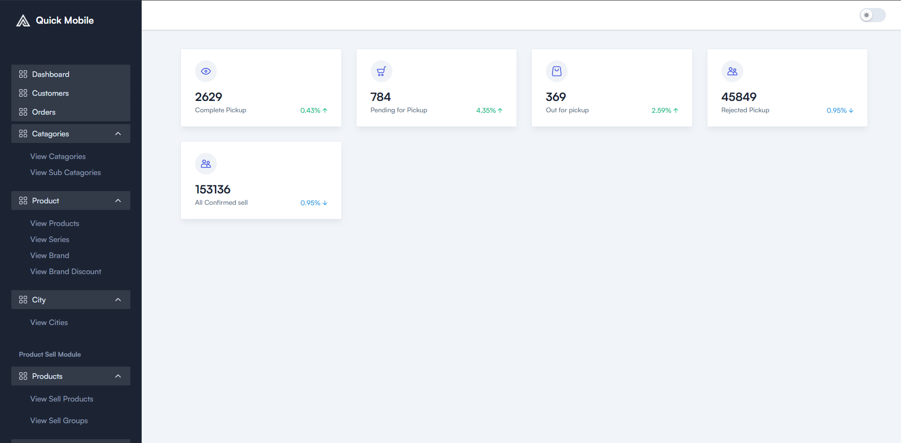
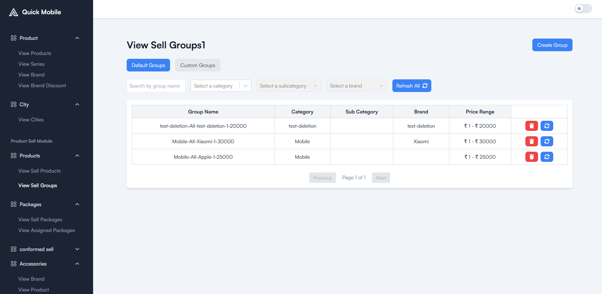

# 📱 Quick Mobile

Quick Mobile is a platform where users can sell their used phones with ease.  
The system also supports product listings, structured question-based packages, and partner-side operations for device pickups.  

---

## 🚀 Features (Customer Side)

- **Product Listings** – Browse phones listed by category, subcategory, series, and brand.  
- **Filtered Search** – Refine results by category, subcategory, brand, and model series.  
- **Answering Packages** – Guided Q&A flow for selling devices through structured packages.  
- **City Selection** – Choose city for availability and localized services.  
- **User Registration** – Sign up and manage your profile seamlessly.  
- **Checkout Flow** – Place orders with a smooth checkout process.  
- **Order Placement** – Confirm selling or buying orders instantly.  
- **Self Profile** – Manage personal details, preferences, and past activities.  

---

## 👨‍💻 My Roles & Responsibilities


- Designed and implemented **customer-side UI** in React with reusable components.
- Integrated SEO optimization (Helmet tags) and performed Lighthouse audits, improving page SEO score and performance by ~30%.
- Built **backend APIs (Node.js, Express, MongoDB)** to manage users, products, and Q&A packages. 
- Integrated **multi-step forms** for device selling with dynamic question rendering.  
- Handled **file uploads (documents, images)** and validation on backend.  
- Implemented **secure authentication & OTP flow** using Nodemailer.    
- Engineered dynamic product listings (brands, packages, categories) with search, filtering, and pagination, boosting user experience and scalability.
- Built secure authentication flows (login, signup) with validation and route-based protection.
- Implemented external API integration for city fetching via pincodes, enhancing personalization for customers.
- Designed smooth order management workflows (browse → cart → order), increasing usability and reducing friction. 

---

## 🛠️ Tech Stack

- **Frontend:** React.js, CSS Modules, ShadCN UI, Tailwind CSS  
- **Backend:** Node.js, Express.js  
- **Database:** MongoDB  
- **Other Tools:** Nodemailer, AWS S3 bucket (file uploads), REST APIs  

---

## ⚡ Setup & Installation

1. ©️ Clone the repo:
   ```bash
   git clone https://github.com/yourusername/quick-mobile.git
   cd quick-mobile

2. 🔽 Install Dependencies:
    ```bash
    npm install

3. 🔰 Start the  development server:
   ```bash
   npm run dev

## 📸 Screenshots (Demo)


<p align="center">
  
</p>


<p align="center">
  
</p>

<p align="center">
  
</p>


<p align="center">
  
</p>


<p align="center">
  
</p>

<p align="center">
  
</p>


<p align="center">
  
</p>

<p align="center">
  
</p>

<p align="center">
  
</p>

<p align="center">
  
</p>

<p align="center">
  
</p>


<p align="center">
  
</p>


<p align="center">
  
</p>


